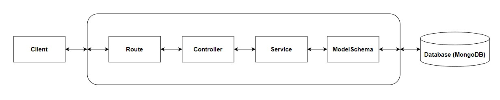

# How to run

1. Clone this repository and go to the `backend` folder

2. Create .env file inside backend folder and add `PORT` field with value `3000` or else

3. Make sure your MongoDB server is running and add the database string connection to `DB_CONNECTION_URI` field in .env file

4. Install all dependencies

   ```
   npm install
   ```

5. Run the aplication

   ```
   npm run dev
   ```

# Database Structure

This project uses MongoDB and below is the database schema I used in this project.

### products

    {
    	_id: ObjectId
    	productLink: string
    	title: string
    	price: integer
    	imgUrl: string
    }

### videos

    {
        _id: ObjectId
        embedUrl: string
    	thumbnailUrl: string
    	productIds: string[], ref -> products
    	comments: Object[] {
    		_id: ObjectId
    		username: string
    		comment: string
    		timestamp: Date
    	}
    }

# API Structure



# Endpoint

## Videos

- Video object

```
{
	_id: string
	embedUrl: string
	thumbnailUrl: string
	productIds: [string]
	comments: [
		<comment_object>,
		<comment_object>,
		<comment_object>
	]
}
```

**GET /api/videos/:videoId**

---

Returns all videos.

- **URL Params**

  _Required:_ `videoId=[string]`

- **Data Params**

  None

- **Headers**

  Content-Type: application/json

- **Success Response:**

- **Code:** 200

  **Content:**

```
{
	status: number
	message: string
	data: <video_object>
}
```

**GET /api/videos**

---

Returns all videos.

- **URL Params**

- **Data Params**

  None

- **Headers**

  Content-Type: application/json

- **Success Response:**

- **Code:** 200

  **Content:**

```
{
	status: number
	message: string
	data: [
		<video_object>,
		<video_object>,
		<video_object>
	]
}
```

## Products

- Product object

```
{
	productId: ObjectId
	productLink: string
	title: string
	price: integer
	imgUrl: string
}
```

**GET /api/products/:videoId**

---

Returns products on the specified video.

- **URL Params**

  _Required:_ `videoId=[string]`

- **Data Params**

  None

- **Headers**

  Content-Type: application/json

- **Success Response:**

- **Code:** 200

**Content:**

```
{
	status: number
	message: string
	data: [
		<prduct_object>,
		<prduct_object>,
		<prduct_object>
	]
}
```

## Comments

- Comment object

```
{
	_id: string
	username: string
	comment: string
	timestamp: Date
}
```

**GET /api/videos/:videoId/comments**

---

Returns comments on specified video.

- **URL Params**

  _Required:_ `videoId=[string]`

- **Data Params**

  None

- **Headers**

  Content-Type: application/json

- **Success Response:**

- **Code:** 200

**Content:**

```
{
	status: number
	message: string
	data: [
		<comment_object>,
		<comment_object>,
		<comment_object>
	]
}
```

**POST /api/videos/:videoId/comments**

---

Submit a comment on a video

- **URL Params**

  _Required:_ `videoId=[integer]`

- **Data Params**

```
{
	username: string
	comment: string
}
```

- **Headers**

  Content-Type: aplication/json

- **Success Response:**

- **Code:** 200

  **Content:**

```
{
	status: number
	message: string
	data: <comment_object>
}
```
