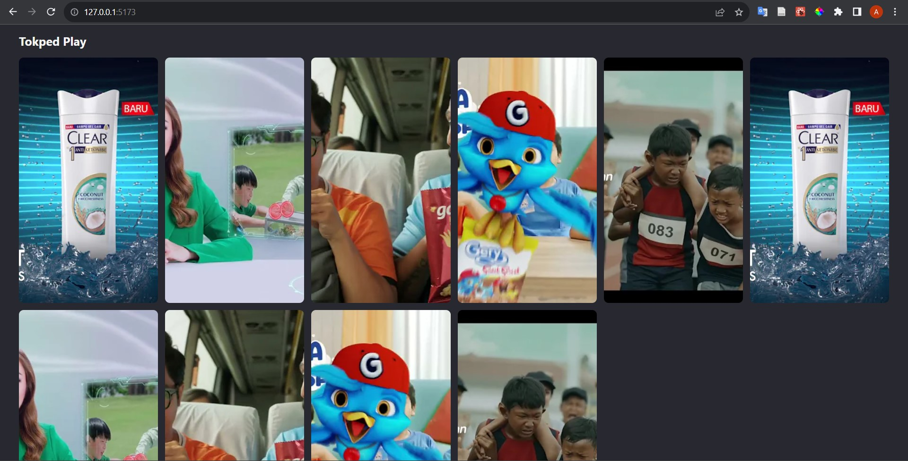
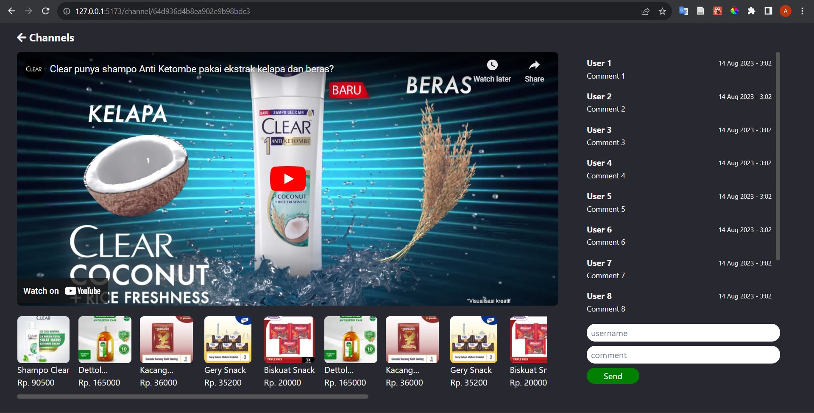

# How to run

1. Clone this repository and go to the `frontend` folder

2. Create .env file and add API_URL field that contains your backend address

3. Install all dependencies

   ```
   npm install
   ```

4. Run the aplication

   ```
   npm run dev
   ```

5. Open `localhost:5173` <br/><br/>

# This app has two pages

- **Main Page** which lists the selling streaming channels to choose from <br/><br/>
   <br/><br/>
- **Channel Page** that shows a selling streaming video with list of products and comments <br/><br/>
   <br/><br/>
